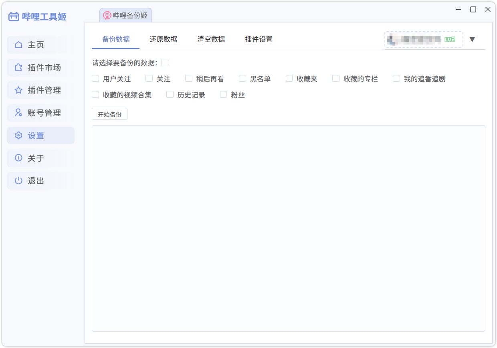

# 哔哩工具姬

> 开发中，尽情期待

一款面向B站用户和开发者的开源工具箱，采用模块化插件架构设计，致力于通过可扩展的功能集合提升用户体验。
用户可自由在线安装和卸载功能模块，开发者可快速开发新插件共享至社区。

## 技术栈

`Vue 3` + `Electron` + `TypeScript` + `Element Plus`

### 项目模块

- [BiliToolkit 哔哩工具姬](https://github.com/hzhilong/bilitoolkit) 主项目
- [bilitoolkit-api-types](https://github.com/hzhilong/bilitoolkit-api-types) 系统 API 定义
- [bilitoolkit-ui](https://github.com/hzhilong/bilitoolkit-ui) 项目 UI 库
- [bilitoolkit-plugin-example](https://github.com/hzhilong/bilitoolkit-plugin-example) 插件示例
- [bilitoolkit-plugin-backup](https://github.com/hzhilong/backup) 从[bilibili-backup](https://github.com/hzhilong/bilibili-backup)移植过来的插件

## 现版本截图

## 致谢

- [bilibili-API-collect](https://github.com/SocialSisterYi/bilibili-API-collect)
- [remixicon](https://github.com/Remix-Design/RemixIcon)
