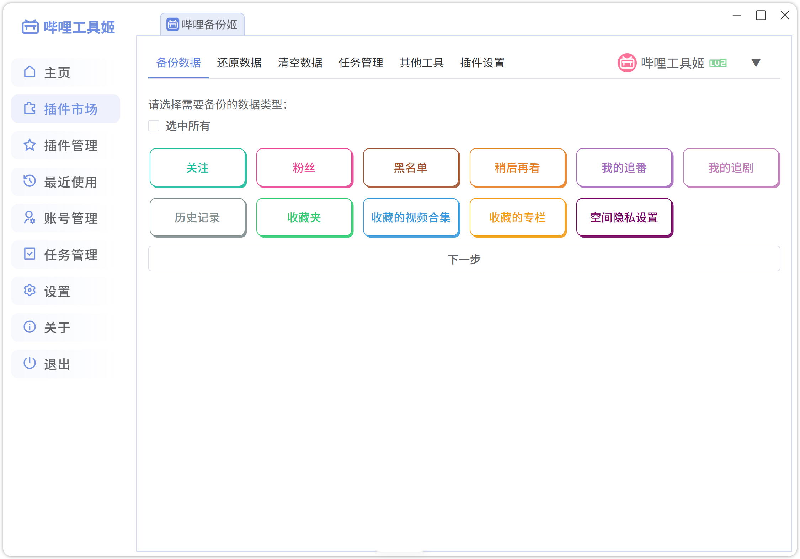

# 哔哩工具姬

一款面向 B 站用户的开源工具箱，支持在线安装和卸载插件，可登录多个账号并按需选择账号执行插件。

## 技术栈

`Vue 3` + `Electron` + `TypeScript` + `Element Plus`

### [插件列表](https://github.com/hzhilong/bilitoolkit-plugins)

| 插件名称                                     | 描述                                |
|------------------------------------------|-----------------------------------|
| [哔哩备份姬](https://github.com/hzhilong/bilitoolkit-plugins/blob/main/bilitoolkit-plugin-backup) | 一键备份和还原 B 站账号数据，快速完成账号数据迁移。       |
| [速升姬](https://github.com/hzhilong/bilitoolkit-plugins/blob/main/bilitoolkit-plugin-quick-upgrade) | 用于自动完成每日经验任务，包括每日登录、观看、投币和分享。     |
| [弹幕工具箱](https://github.com/hzhilong/bilitoolkit-plugins/blob/main/bilitoolkit-plugin-danmaku) | 快速查询弹幕及发送者。                       |
| [图片下载](https://github.com/hzhilong/bilitoolkit-plugins/blob/main/bilitoolkit-plugin-image-downloader) | 快速下载专栏、动态、评论中的图片与表情包，以及视频封面、直播封面和用户头像。 |

## [开发说明](./doc/development.md)

## 截图

## 注意事项

* 使用本项目产生的任何后果由使用者自行承担；
* 本项目仅供学习、研究和技术交流使用，请勿将其用于违反相关平台规则的用途；
* 本项目与哔哩哔哩官方无任何关联。

## 致谢

- [bilibili-API-collect](https://github.com/SocialSisterYi/bilibili-API-collect)
- [remixicon](https://github.com/Remix-Design/RemixIcon)
